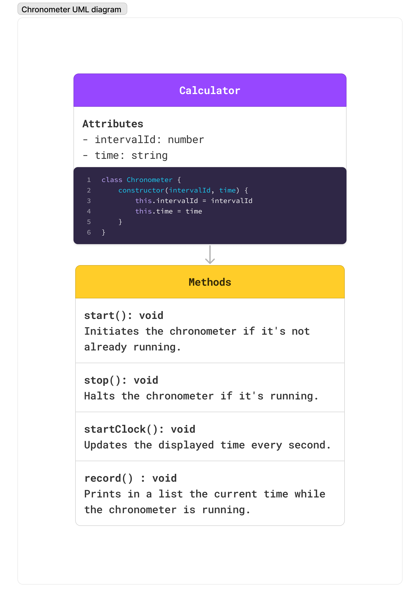

# JS Chronometer
This project is a JavaScript-based chronometer designed to track time intervals accurately. It offers essential functionalities to start, stop, and record time.

## UML Calculator Diagram
Represents the structure and functionality of the `Chronometer` class.

## Demo

[Click here to try out the chronometer live!](https://js-time-tracker.netlify.app/)